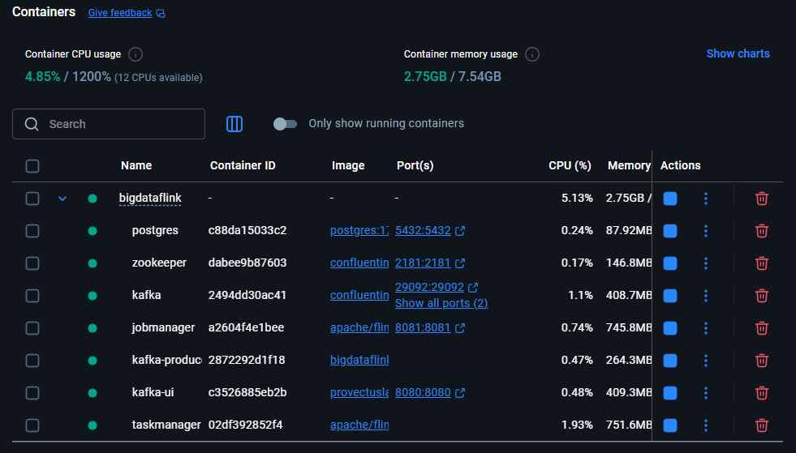
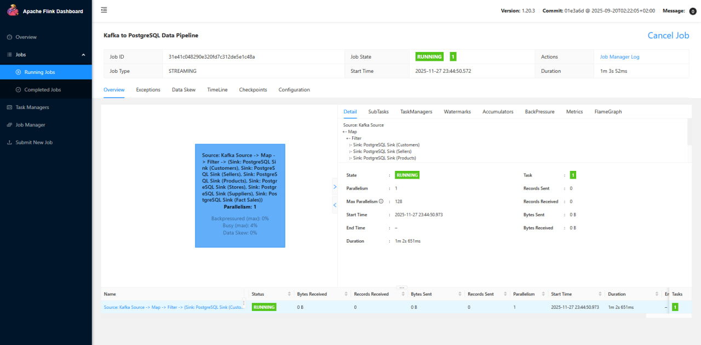
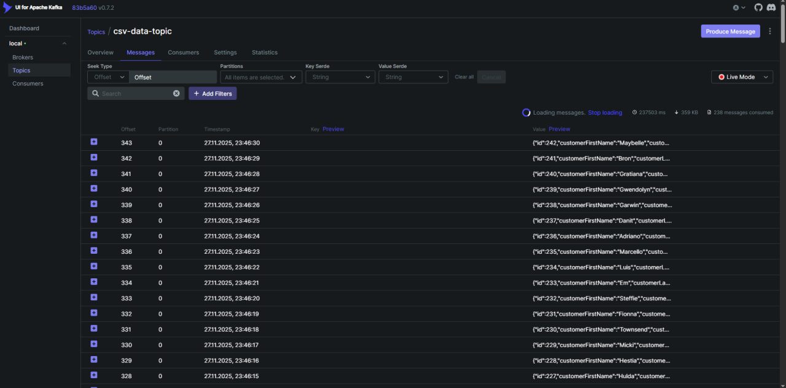

# Отчет по лабораторной работе №3 - Streaming Processing на Apache Flink
### Попов Илья Павлович М8О-209СВ-24
Реализован streaming ETL-пайплайн на Apache Flink для преобразования JSON-данных из Kafka в модель "звезда" в PostgreSQL в реальном времени.

## Архитектура решения
- **Источник данных:** CSV файлы → Kafka Producer → JSON в топике `csv-data-topic`
- **Streaming обработка:** Apache Flink чтение Kafka → трансформация → запись в PostgreSQL
- **Целевая модель:** Звездообразная схема в PostgreSQL (6 таблиц)

## Запуск системы

### 1. Сборка приложения
```bash
mvn clean package
```

### 2. Запуск инфраструктуры
```bash
docker-compose up -d
```

### 3. Запуск Flink job
```bash
docker exec -it jobmanager /opt/flink/bin/flink run -c ru.lunidep.flinkjob.KafkaToPostgresJob /opt/flink-job/flink-job-1.0.0.jar
```

## Визуализация работы системы

**Docker Containers** - управление всей инфраструктурой через Docker Desktop:


### Мониторинг потоковой обработки

**Flink Web UI** (`http://localhost:8081`) - отслеживание выполнения джоб и метрик потоковой обработки:


**Kafka UI** (`http://localhost:8080`) - мониторинг топиков, потребления сообщений и lag:
