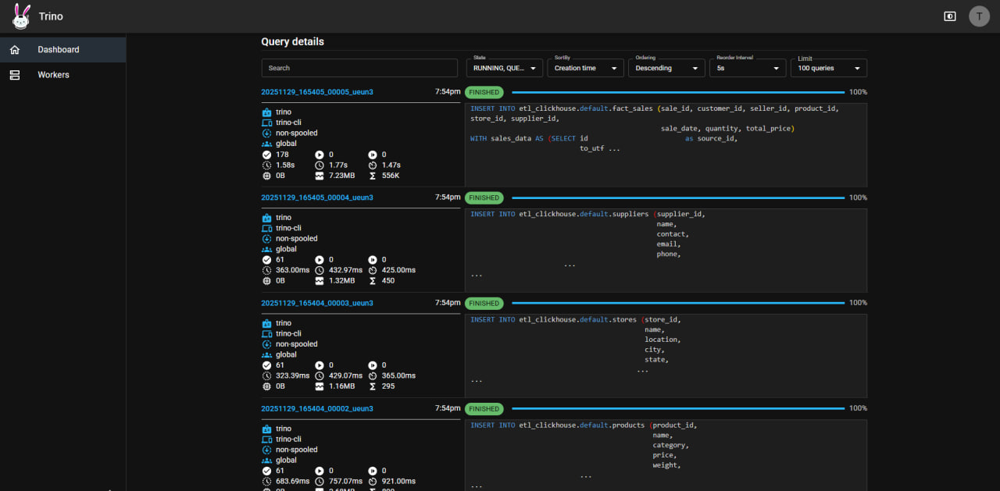
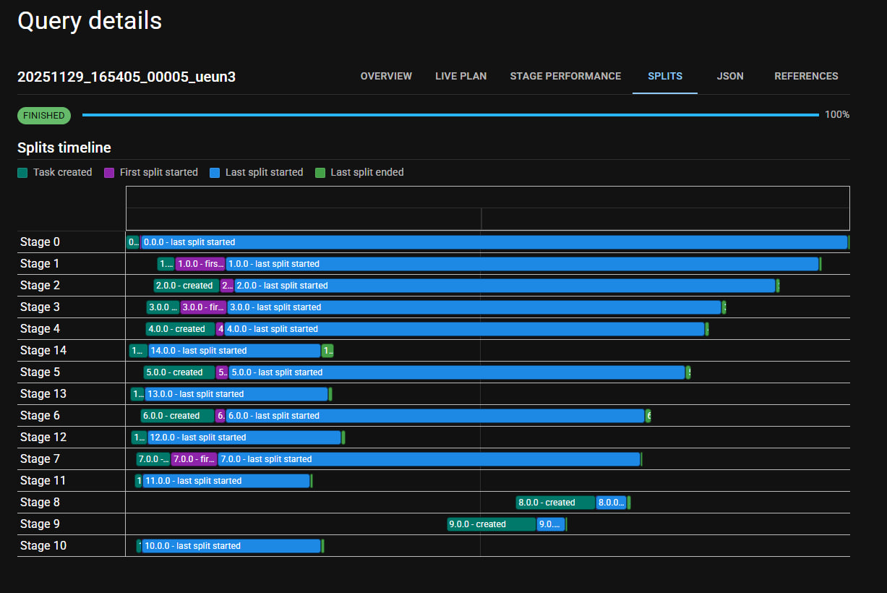

# Отчет по лабораторной работе №4 - ETL на Trino
### Попов Илья Павлович М8О-209СВ-24

Реализован ETL-пайплайн на Trino для трансформации данных из PostgreSQL и ClickHouse в модель "звезда" в ClickHouse с последующей генерацией аналитических отчетов.

## Архитектура решения


## Запуск системы

### 1. Запуск инфраструктуры
```bash
docker-compose up -d
```

### 2. Заполнение модели "звезда" в ClickHouse
```bash
docker exec trino-coordinator trino --server localhost:8080 -f /scripts/populate_star_schema.sql
```

### 3. Генерация аналитических отчетов
```bash
docker exec trino-coordinator trino --server localhost:8080 -f /scripts/reports.sql
```

## Визуализация работы запросов в UI Trino
Cписок запросов на trino-coordinator


Детали выполнения конкретного запроса 


## Модель данных "звезда"

Реализована следующая структура витрины данных:

### Фактовая таблица:
- **sales** - продажи

### Таблицы измерений:
- **customers** - клиенты
- **products** - продукты
- **stores** - магазины
- **suppliers** - поставщики
- **time** - временные периоды

## Соответствие отчетов требованиям лабораторной работы

| Требуемая витрина | Реализованные отчеты в ClickHouse |
|-------------------|-----------------------------------|
| **1. Витрина продаж по продуктам** | |
| Топ-10 самых продаваемых продуктов | `product_sales_top10` |
| Общая выручка по категориям продуктов | `product_category_revenue` |
| Средний рейтинг и количество отзывов | `product_ratings_summary` |
| **2. Витрина продаж по клиентам** | |
| Топ-10 клиентов с наибольшей суммой покупок | `customer_sales_top10` |
| Распределение клиентов по странам | `customers_by_country` |
| Средний чек для каждого клиента | `customer_avg_check` |
| **3. Витрина продаж по времени** | |
| Месячные и годовые тренды продаж | `sales_monthly_trends`, `sales_yearly_trends` |
| Сравнение выручки за разные периоды | `sales_period_comparison` |
| Средний размер заказа по месяцам | `monthly_avg_order_size` |
| **4. Витрина продаж по магазинам** | |
| Топ-5 магазинов с наибольшей выручкой | `store_sales_top5` |
| Распределение продаж по городам и странам | `sales_by_store_location` |
| Средний чек для каждого магазина | `store_avg_check` |
| **5. Витрина продаж по поставщикам** | |
| Топ-5 поставщиков с наибольшей выручкой | `supplier_sales_top5` |
| Средняя цена товаров от каждого поставщика | `supplier_avg_price` |
| Распределение продаж по странам поставщиков | `sales_by_supplier_country` |
| **6. Витрина качества продукции** | |
| Продукты с наивысшим и наименьшим рейтингом | `products_highest_rated`, `products_lowest_rated` |
| Корреляция между рейтингом и объемом продаж | `rating_sales_correlation` |
| Продукты с наибольшим количеством отзывов | `products_most_reviewed` |
